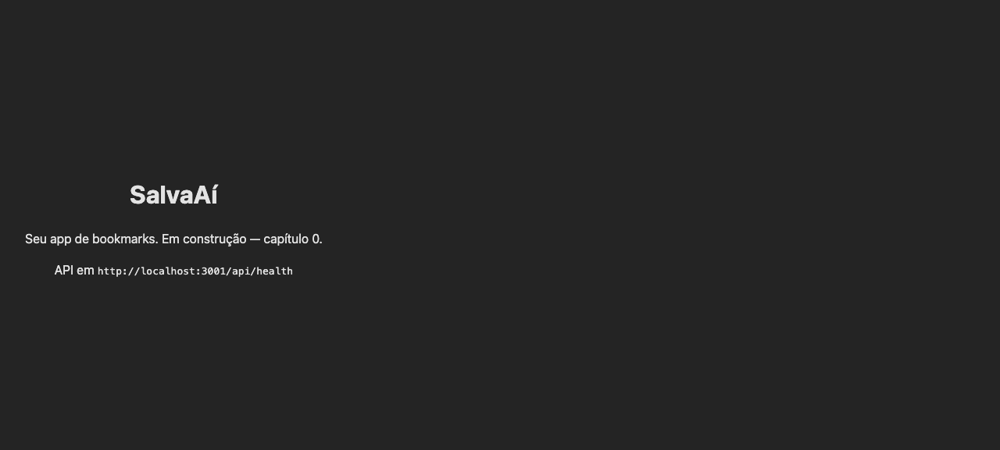

# Capítulo 0 — Setup do ambiente

> **Objetivo:** ao fim deste capítulo, um único comando (`bun dev`) sobe a API e o frontend juntos, com TypeScript estrito, lint e formatação funcionando em todo o monorepo.



## O que vai funcionar

- `bun install` instala as dependências dos dois apps de uma vez.
- `bun dev` sobe a API em `http://localhost:3001` e o web em `http://localhost:5173`.
- A API responde `{"status":"ok"}` em `/api/health`.
- O navegador mostra a página inicial do SalvaAí.

## Decisões

| Decisão                            | Alternativas                  | Por quê                                                                                                                                                                                      |
| ---------------------------------- | ----------------------------- | -------------------------------------------------------------------------------------------------------------------------------------------------------------------------------------------- |
| Monorepo (Bun workspaces)          | Dois repositórios separados   | Frontend e backend compartilham vocabulário (os tipos do bookmark). Um só `bun install` e scripts unificados na raiz evitam o inferno de "rodar dois terminais com versões diferentes".      |
| Bun como runtime/gerenciador       | npm/pnpm + Node               | Instalação rápida, workspaces nativos, e o mesmo binário roda o servidor e os testes. Menos ferramentas pra aprender no começo.                                                              |
| TypeScript desde o dia 1           | JS com TS depois              | Migrar é muito mais doloroso que começar certo. O `tsconfig.base.json` na raiz define o padrão estrito; cada app só adiciona o que precisa (DOM pro React, tipos do Bun pra API).            |
| ESLint + Prettier separados        | Biome, oxlint                 | São o par mais documentado; para um curso, o valor está em explicar _o que_ cada um pega: Prettier cuida de formato, ESLint de erros reais. `eslint-config-prettier` evita briga entre eles. |
| Teste da API antes do código (TDD) | Escrever tudo e testar depois | O teste do `/api/health` veio primeiro e falhou — aí escrevemos o mínimo pra fazê-lo passar. É o ritmo que vamos repetir no capítulo 2.                                                      |

## Passo a passo

### 1. A raiz do monorepo

O `package.json` da raiz não tem dependências de aplicação — só orquestra:

```json
{
  "workspaces": ["apps/*"],
  "scripts": {
    "dev": "bun run --filter='*' dev",
    "test": "bun test"
  }
}
```

> **Prompt usado com a IA:** _"Crie a raiz de um monorepo Bun com workspaces em apps/_. Quero um script dev que rode api e web em paralelo e um script test que rode todos os testes."*

O truque é o `--filter='*'`: o Bun procura um script `dev` dentro de cada workspace e roda todos em paralelo.

### 2. O TypeScript compartilhado

`tsconfig.base.json` na raiz guarda as regras estritas. Os apps herdam com `"extends"`:

```json
// apps/api/tsconfig.json
{
  "extends": "../../tsconfig.base.json",
  "compilerOptions": { "types": ["bun"] },
  "include": ["src"]
}
```

Cada app adiciona só o seu contexto: a API conhece os tipos do Bun, o web conhece o DOM.

### 3. A API mínima (test-first)

Antes de qualquer linha de Hono, o teste já existia:

```ts
// apps/api/src/app.test.ts
it("responde 200 com status ok", async () => {
  const res = await app.request("/api/health");
  expect(res.status).toBe(200);
  expect(await res.json()).toEqual({ status: "ok" });
});
```

Rodar `bun test apps/api` deu vermelho (`Cannot find module './app'`). Só então o `app.ts` nasceu:

```ts
import { Hono } from "hono";

export const app = new Hono();

app.get("/api/health", (c) => c.json({ status: "ok" }));
```

Repare que o `app` é exportado separado do `index.ts` (o entrypoint com `Bun.serve`). Isso permite testar a aplicação inteira sem abrir porta nenhuma — o `app.request()` processa uma requisição na memória.

> **Prompt usado com a IA:** _"Escreva um teste bun:test para uma rota /api/health de um app Hono que retorna {status:'ok'}, depois implemente o mínimo pra passar. Separe o app do entrypoint pra testar sem servidor."_

### 4. O frontend

Scaffold do Vite com o template react-ts, e então a limpeza: removemos o demo do contador e deixamos uma página única apontando pra API. O `package.json` do web ganhou o nome `@salvaai/web` e o script `typecheck` — padronizar os nomes dos scripts entre apps é o que faz o `--filter='*'` funcionar.

## O que aprender

- **Workspaces**: um repositório, vários pacotes, dependências compartilhadas.
- **tsconfig em camadas**: base estrita na raiz, específicos por app.
- **Teste antes do código**: ver o teste falhar primeiro garante que ele testa de verdade.
- **Separação app/entrypoint**: a aplicação é uma função de requisição → resposta; o servidor é só detalhe.

## Checklist

- [x] `bun install` funciona na raiz, sem entrar em subpastas
- [x] `bun dev` sobe api (3001) e web (5173) juntos
- [x] `curl http://localhost:3001/api/health` retorna `{"status":"ok"}`
- [x] `bun typecheck`, `bun lint` e `bun test` passam
- [x] `http://localhost:5173` mostra a página do SalvaAí
