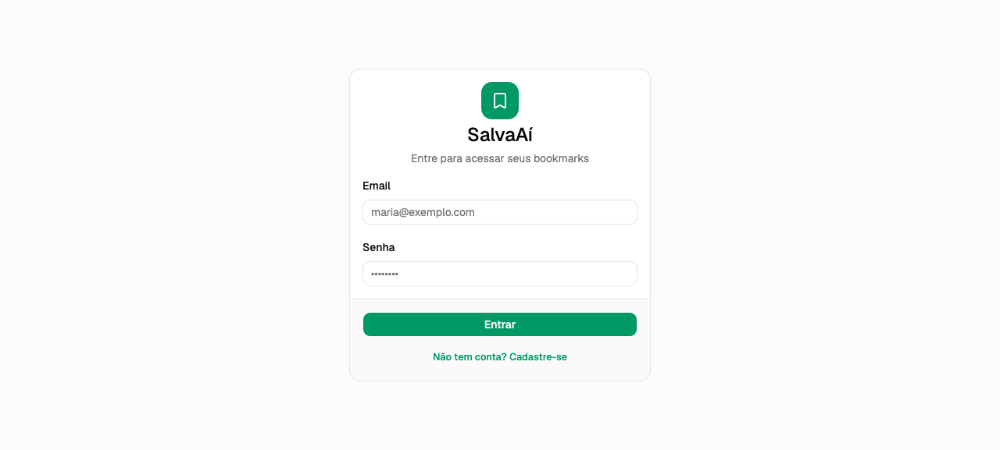

# Capítulo 4 — O frontend

> **Objetivo:** ao fim deste capítulo, o app tem cara nova: tela de login/cadastro com validação, lista de bookmarks em grid de cards, formulário de criar/editar em dialog e confirmação antes de excluir. Tudo com dados **mockados** — a conexão real com a API é o Capítulo 5.

**Evidência (a tela de login, com o tema verde do SalvaAí):**



## Decisões

| Decisão                                     | Alternativas                              | Por quê                                                                                                                                                                                                            |
| ------------------------------------------- | ----------------------------------------- | ------------------------------------------------------------------------------------------------------------------------------------------------------------------------------------------------------------------ |
| shadcn/ui copiado para dentro do projeto    | Biblioteca de componentes (MUI, Ant)      | O código dos componentes vive em `src/components/ui` — dá pra ler, entender e mudar. Para quem está aprendendo, "abrir a caixa" vale mais do que importar caixa-preta.                                             |
| UI pronta antes da integração               | Construir tela e fetch juntos             | Com dados mockados, o capítulo entrega algo visível sem depender da API. O contrato visual fica pronto; trocar o mock por `fetch` depois é cirúrgico.                                                              |
| Latência simulada (`esperar(500)`)          | Render instantâneo do mock                | Sem espera, os estados de loading nunca apareceriam — e estado de loading que não se vê é estado que não se testa.                                                                                                 |
| `BookmarkInput` separado de `Bookmark`      | Um tipo só com campos opcionais           | O que o formulário envia (`title`, `url`, `description`, `tags`) é diferente do que a lista guarda (`id`, `createdAt` vêm de fora). Tipos separados documentam essa fronteira — e espelham o que a API vai exigir. |
| Validação espelhando as regras da API       | Validar só no backend (ou só no frontend) | A API do Capítulo 2 já valida; o form valida de novo para dar feedback imediato. Nenhuma das duas confia na outra — frontend valida por UX, API valida por segurança.                                              |
| Dialog controlado (`open` + `onOpenChange`) | Dialog com trigger interno                | O mesmo dialog serve para criar e editar; quem decide o que ele mostra é a página, não o componente. Um estado (`emEdicao: Bookmark \| null`) comuta os dois modos.                                                |
| Confirmação de delete com AlertDialog       | `window.confirm`                          | O AlertDialog é acessível (foco preso, ESC, aria) e visualmente parte do app. `confirm()` quebra o estilo e não é customizável.                                                                                    |

## Passo a passo

### 1. Instalar o shadcn/ui e os componentes

```bash
bunx --bun shadcn@latest init        # uma vez: cria components.json + tema
bunx --bun shadcn@latest add button card input label field \
  dialog alert-dialog textarea badge skeleton --yes
```

O `--yes` aceita os defaults sem prompt. Os arquivos caem em `src/components/ui/` — **são seus**, pode editar.

> **Prompt usado com a IA:** _"Instale o shadcn/ui num app Vite + React + Tailwind v4 e adicione os componentes button, card, input, label, field, dialog, alert-dialog, textarea, badge e skeleton."_

### 2. Tematizar

A identidade do app mora em variáveis CSS (`--primary`, `--ring`, ...) no `src/index.css`. Trocar a cor de marca é mudar **um** token:

```css
:root {
  --primary: oklch(0.596 0.145 163.225); /* verde — botões, links, foco */
}
.dark {
  --primary: oklch(0.696 0.17 162.48); /* um tom mais claro no escuro */
}
```

Todos os componentes consomem `bg-primary`, `text-primary` etc. — a mudança se propaga sozinha.

### 3. Tipos e mock

```ts
// src/types.ts — espelha o schema da API (cap-01)
export type Bookmark = {
  id: string;
  title: string;
  url: string;
  description: string | null;
  tags: string[];
  createdAt: string;
};
export type BookmarkInput = Omit<Bookmark, "id" | "createdAt">;
```

O mock (`src/data/mock-bookmarks.ts`) guarda a lista inicial e um `esperar(ms)` que devolve uma Promise — é ele quem faz o loading existir.

### 4. As telas

- **`auth-screen.tsx`** — login e cadastro no mesmo card, alternados por um estado `modo`. Validação inline com `Field`/`FieldError`: email válido, senha ≥ 8, nome obrigatório só no cadastro.
- **`bookmarks-page.tsx`** — dona do estado: carrega o mock, guarda a lista e orquestra os dialogs. Grid responsivo (`sm:grid-cols-2 lg:grid-cols-3`) de `BookmarkCard`, com **skeletons** durante o load e **empty state** com call-to-action quando a lista está vazia.
- **`bookmark-form-dialog.tsx`** — um dialog, dois modos: `bookmark === null` cria, senão edita (campos pré-preenchidos via `useEffect`). Tags entram como texto livre separado por vírgula e saem como `string[]` normalizado (trim, lowercase, sem vazios).
- **`bookmark-card.tsx`** — card burro (só exibe + dispara callbacks): hostname extraído da URL, título linkado (`target="_blank"`), descrição, badges de tags e ações de editar/excluir.
- **`confirm-delete-dialog.tsx`** — AlertDialog que recebe o bookmark a excluir ou `null` (fechado).

A composição fica na página: cards e dialogs não sabem da existência uns dos outros.

### 5. Rodar e conferir

```bash
bun dev        # web em localhost:5173
```

Fluxo de teste: entre com qualquer email/senha (ainda não valida contra a API) → crie, edite e exclua bookmarks → recarregue a página e veja tudo voltar ao mock. É assim mesmo: **estado em memória até o capítulo 5**.

## O que aprender

- **Componentes copiáveis vs bibliotecas**: com shadcn, o código é do app — leia o `button.tsx`, veja como `cva` + `cn` montam as variantes.
- **Design tokens**: uma cor de marca é uma variável CSS, não um valor hex repetido em 20 lugares.
- **Estados que o Figma esquece**: loading (skeleton), vazio (call-to-action), erro de validação (inline no campo). Toda lista tem pelo menos os dois primeiros.
- **Componente burro vs página inteligente**: cards e dialogs recebem props e disparam callbacks; só a página conhece a lista inteira.
- **Um dialog, dois modos**: criar e editar são o mesmo form com dados diferentes — `null` é o flag.

## Checklist

- [x] shadcn/ui instalado e tematizado (verde SalvaAí, tokens em `index.css`)
- [x] Tela de login/cadastro com validação inline e alternância de modo
- [x] Lista de bookmarks em grid responsivo de cards
- [x] Estados de loading (skeletons) e vazio (call-to-action)
- [x] Criar e editar no mesmo dialog, com validação espelhando a API
- [x] Exclusão sempre com confirmação (AlertDialog)
- [x] Dados mockados com latência simulada — integração real no cap-05
